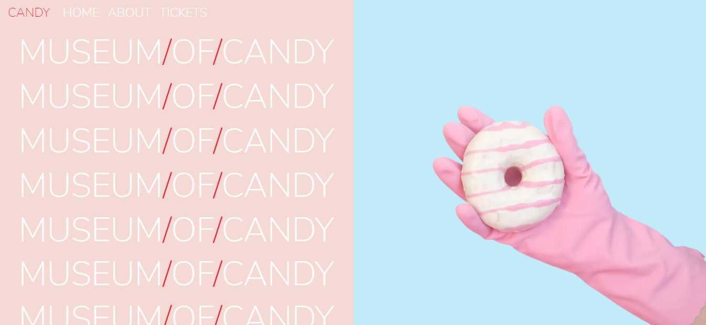

# Museum of Candy
 

## Table of contents

- [Overview](#overview)
  - [Screenshot](#screenshot)
  - [Links](#links)
- [My process](#my-process)
  - [Built with](#built-with)
  - [What I learned](#what-i-learned)
  - [Useful resources](#useful-resources)
- [Author](#author)

## Overview

Tinder for dogs

### Screenshot

### Links

- Solution URL: [Github](https://github.com/aldovizcarra/museum-of-candy)
- Live Site URL: [Live Site](https://aldovizcarra.github.io/museum-of-candy/)

## My process

I built this website using css bootstrap.

### Built with

- Semantic HTML5 markup
- CSS custom properties
- Bootstrap

### What I learned

During this project I learned how to use bootstrap.

### Useful resources

- [Udemy](https://www.udemy.com) - This helped me with bootstrap.

## Author

- Website - [Aldo Vizcarra](https://github.com/aldovizcarra)
- Frontend Mentor - [@aldovizcarra](https://www.frontendmentor.io/profile/aldovizcarra)
